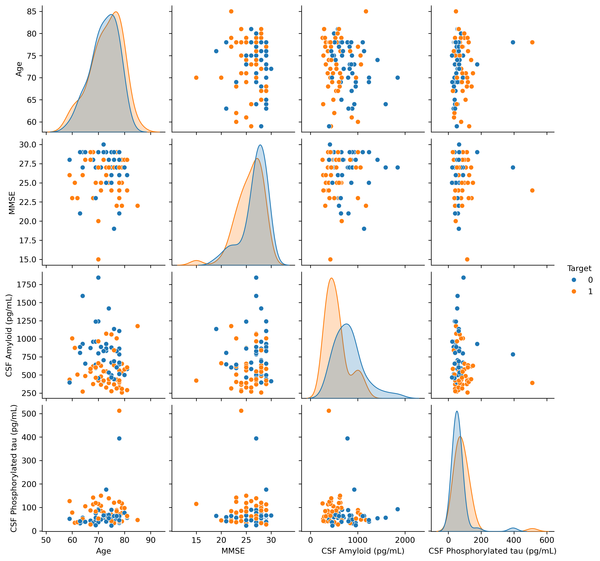

# U.C. Berkeley Engineering Capstone Project

* Charles David Harris
* davidharrisne@gmail.com

## Predicting Progression to Alzheimer's Disease from Blood Protein Levels

### Abstract
This project explored a Kaggle dataset to test the hypothesis that Amyloid and Tau protein levels are predictive of someone developing alzhiemers in the future. Medical diagnosis are concerned for false negatives, so these models were evaluated by Recall, and ROC_UAC 
This project asks the question: **Among patients with with Mild Cognitive Impairment (MCI), can we predict who will progress to Alzheimer's, using Tau and Amyloid blood/CSF protein levels?**

This test was approached from two approaches:
 1. An exhaustive parameter evaluation using LogisticRegression confirmed that 'CSF Amyloid (pg/mL)', 'CSF Phosphorylated tau (pg/mL)' are the best features. The best hyperparameters were derived from GridSearchCV, which resulted in a model of 
 

  Metric | Value |
|---|---|
| Accuracy | 0.7778 |
| Precision | 0.8000 |
| Recall | 0.8000 |
| ROC AUC | 0.8500 |
| False Negatives | 2 |
| False Negative Rate | 0.2000 |

  [Logisticregression](logistic_regression_pipeline.ipynb) 

2. A classifier first model where given all the parameters, the best classier as determined. The winner, 
KNeighborsClassifier, was then hyperpareterized with GridSearchCV producing a model with these 

| Metric | Value |
|---|---|
| Accuracy | 0.6667 |
| Precision | 0.7000 |
| Recall | 0.7000 |
| ROC AUC | 0.6125 |
| False Negatives | 3 |
| False Negative Rate | 0.3000 |

[KNearestNeighbors](knearest_neighbors_pipeline.ipynb)

 LogisticRegression arose as the best model adn was deployed for testing in  [Logisticregression](logistic_regression_pipeline.ipynb) 

| Profile | CSF Amyloid (pg/mL) | CSF Phosphorylated tau (pg/mL) |
|---|---|---|
| High-risk profile | 368.2 | 119.2 |
| Median profile | 604.0 | 63.5 |
| Low-risk profile | 1062.0 | 37.1 |
| Extreme AD-like | 257.0 | 512.0 |
| Extreme low-risk | 1845.0 | 22.4 |

### Report Artifacts
1. This README has a high level overview of the project. 
2. [main.ipynb](main.ipynb) contain more granular work for **Business Understanding** and **Data Understanding** 
3. [decison_boundaries](decision_boundaries.ipynb) contains exploartory charts for "Progression" and "No Progresion" 
4. [logistic_regression_pipeling](logistic_regression_pipeline.ipynb) contains the work for the "Parameter First" approach
5. [knearest_neighbors_pipelikne](knearest_neighbors_pipeline) has code for the "Classifiction First" approach

### This report follows the CRISP-DM methodology

1. [Business Understanding](#business-understanding)
2. [Data Understanding](#data-understanding)
3. [Data Preparation](#data-preparation)
4. [Modeling](#modeling)
5. [Evaluation](#evaluation)
6. [Conclusion](#conclusion)
7. [References](#references)

# 1. Business Understanding
## Clinical Background

* Alzhiemer's Disease Epidemic

Worlwide, there are greater than 55 million living with Alzheimer's Disease, and baring medicl breakthroughs this number will double evey 20 years. 

* Symptoms

 "Accumulation of the protein beta‐amyloid outside neurons and twisted strands of the protein tau inside neurons are hallmarks. They are accompanied by the death of neurons and damage to brain tissue. Inflammation and atrophy of brain tissue are other changes."[3] 
[Mayo Clinic](https://newsnetwork.mayoclinic.org/discussion/mayo-clinic-scientists-create-tool-to-predict-alzheimers-risk-years-before-symptoms-begin/) researchers have shown that two proteins in spinal fluid — amyloid and tau — can point toward who is at risk of developing Alzheimer's, years before symptoms appear.[4] 

The Mayo Clinic's own prediction model combined age, sex, APOE genotype, and brain amyloid levels from PET scans. Of all the predictors they evaluated, amyloid levels had the single largest effect on lifetime risk of both MCI and dementia — which is why this project starts from the hypothesis that amyloid and tau levels, on their own, should carry real signal.
This project uses the Kaggle dataset [Plasma lipidomics in Alzheimer's disease](https://www.kaggle.com/datasets/fereshtehjozaghkar/plasma-lipidomics-in-alzheimers-disease) — real patient measurements for 212 people, of whom 89 have a known MCI-to-Alzheimer's outcome. That is a small dataset for an epidemic-scale question, and that mismatch means that the decisions in this project were made with caution.

#### The Accuracy Trap

In a clinical setting, accuracy comes with risk. A model can post a high accuracy number while failing to identity patients who progress to alzhiemers - the False Negative diagnosis.

**In medical screening for a fatal disease, relying only on a general "False Negative Score" or a standard F1 score is not good enough because they treat false negatives and false positives with equal weight.When a disease is fatal, a False Negative means a sick patient is sent home untreated, which can lead to death. A False Positive means a healthy person gets extra tests, causing temporary anxiety but saving lives overall. Therefore, you must use metrics that specifically isolate and minimize false negatives.

"
If you artificially balanced only the test set (e.g., undersampled negatives to evaluate), your ROC-AUC there won't reflect real-world deployment performance, since in production the disease is presumably still rare. A model can look great on a balanced test set and underperform in deployment because the operating point (threshold) that worked in balanced conditions doesn't map cleanly onto a population where positives are 1% instead of 50%.
"
### Reading a confusion matrix

Every prediction a model makes lands in one of four boxes, depending on what actually happened to the patient versus what the model guessed:

The box that matters most clinically is the **False Negative**: a patient who is actually heading toward Alzheimer's, but the model tells them — and their doctor — not to worry. Every metric below is really just a different way of watching that one box.

**Accuracy** — overall, how often was the model right?

$$\text{accuracy} = \frac{\text{true positives} + \text{true negatives}}{\text{everyone}}$$

Misleading on its own here, because it treats a missed progressor and a false alarm as equally bad — it can't tell them apart.

**Recall** answers: of everyone who actually progressed to Alzheimer's, how many did the model catch?

$$\text{recall} = \frac{\text{true positives}}{\text{true positives} + \text{false negatives}} = \frac{\text{correct positive predictions}}{\text{all actual positives}}$$

**F2** answers: weighing precision and recall together, but caring more about recall — how well did the model do overall?

$$F_2 = 5 \times \frac{\text{precision} \times \text{recall}}{4 \times \text{precision} + \text{recall}}$$

For this work, F2, was chosen as the metric to look for. In a medical diagnosis, looking at false negatives is not enough as it ignores false positives - where patients who will not develop alzhiemer's are subjected to the anxiety and financial burden to unecessary treatment. F2 is a balance between precission and recall placing twice the weight of recall as precision. 

# 2. Data Understanding

The dataset contains 212 patients across three diagnostic categories:

Only the 89 patients already diagnosed with Mild Cognitive Impairment have a known "Progression to Alzheimer's Disease" outcome — nobody who is already healthy or already has an AD diagnosis has a progression label So real question this project answers was **of patients already showing Mild Cognivite Impairment, who is going to develop alzhiemer's**

**Concerns**: 89 labeled patients is a small dataset. Small samples are sensitive to exactly which patients land in a given train/test split or cross-validation fold, so results throughout this report should be read as suggestive, not definitive.

**Class balance**: at 53% Yes / 47% No, the MCI subset is close enough to balanced that this study does not apply any class-balancing techniques.

**Parameter Choice**
The thesis is Amyloid and Tau are primary indicators of developing alziemer's.
This pair plot explores the other parameters of the data set.

Show correlations plot 

| Feature | Importance | Std |
|---|---|---|
| CSF Total tau (pg/mL) | 0.216667 | 0.067814 |
| CSF Amyloid (pg/mL) | 0.161111 | 0.094444 |
| Sex | 0.155556 | 0.095581 |
| Age | 0.133333 | 0.066667 |
| CSF Phosphorylated tau (pg/mL) | 0.111111 | 0.065734 |
| APOE4 | 0.111111 | 0.049690 |
| MMSE | 0.055556 | 0.043033 |

[knearest_neighbors_pipeline](knearest_neighbors_pipeline.ipynb#coefficients)

### Setting expectations for the biology

Before any modeling, it's worth checking visually whether the two biomarkers the Mayo Clinic hypothesis points to — CSF amyloid and CSF phosphorylated tau — actually separate progressors from non-progressors in this dataset, and in the expected direction (low amyloid, high tau → higher risk):

# 4. Modeling

## Approach 1: Exhaustive feature search → Logistic Regression

**[`false_negative_rate.ipynb`](false_negative_rate.ipynb)** resolves the ordering problem by brute force: it checks **every possible combination of features** before ever picking an algorithm.

1. **Feature search.** Every non-empty subset of the 7 candidate features was tried — 2⁷ − 1 = **127 combinations** — each scored with a neutral, fixed Logistic Regression so the feature search wouldn't be quietly biased toward whichever algorithm came next. Every combination was filtered to keep only those with a false-negative rate at or below 20% *before* ranking by accuracy — false negatives were never allowed to be traded away for a better headline number. Only 8 of 127 combinations survived that filter. The winner: **CSF Amyloid + CSF Phosphorylated tau**, a simpler pair than initially expected.
2. **Algorithm search.** That winning pair of features was then run through seven candidate algorithms (Logistic Regression, Random Forest, SVM, Gradient Boosting, KNN, LDA, Naive Bayes), with the same false-negative filter applied first. Logistic Regression won — a genuinely tuned win this time, not the neutral placeholder from step 1.
3. **Hyperparameter search.** `GridSearchCV` was run twice over Logistic Regression's `C` (regularization strength) and `class_weight`, once scored on plain recall and once on **F2** (a precision/recall blend that weights recall — catching progressors — twice as heavily as precision). Scoring on recall alone pushed the model toward flagging almost everyone as "will progress," which trimmed the false-negative rate a little further but gutted accuracy and precision along the way. Scoring on F2 struck a better balance and is the version actually deployed: **`C=10`, no class weighting.**

This is an honestly brute-force approach — the 127-combination search only works because there are just 7 candidate features (2ᴺ grows fast); a real biomarker panel with dozens of candidates would need a smarter search strategy instead.

# 5. Evaluation

# 6. Conclusion

# References

1. 2025 Alzheimer's disease facts and figures. Alzheimers Dement. 2025 Apr 29;21(4):e70235. doi: 10.1002/alz.70235. PMCID: PMC12040760.
1. Mayo Clinic: [Mayo Clinic scientists create tool to predict Alzheimer's risk years before symptoms begin](https://newsnetwork.mayoclinic.org/discussion/mayo-clinic-scientists-create-tool-to-predict-alzheimers-risk-years-before-symptoms-begin/)
1. Decision Boundaries [Analysis](decision_boundaries.ipynb)
1. Alzheimer's Disease International, https://www.alzint.org/about/dementia-facts-figures/dementia-statistics/, 
2. Dataset: [Plasma lipidomics in Alzheimer's disease](https://www.kaggle.com/datasets/fereshtehjozaghkar/plasma-lipidomics-in-alzheimers-disease) (Kaggle)

