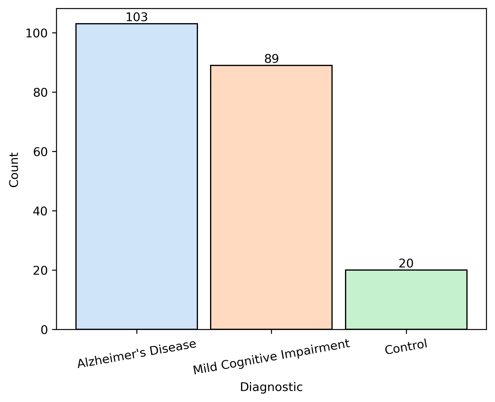
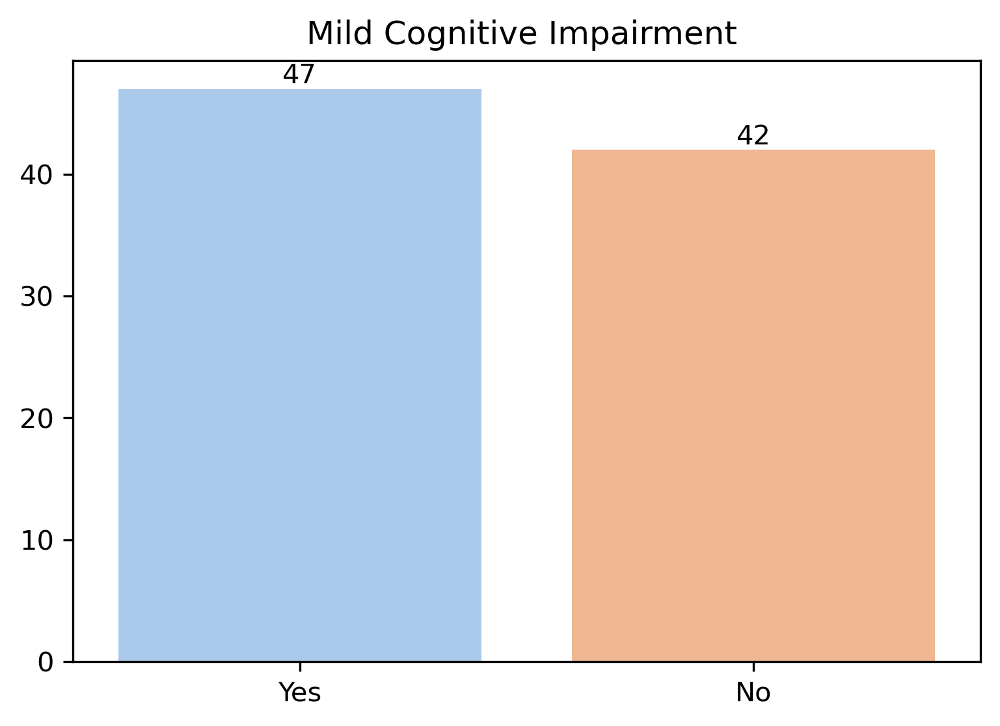
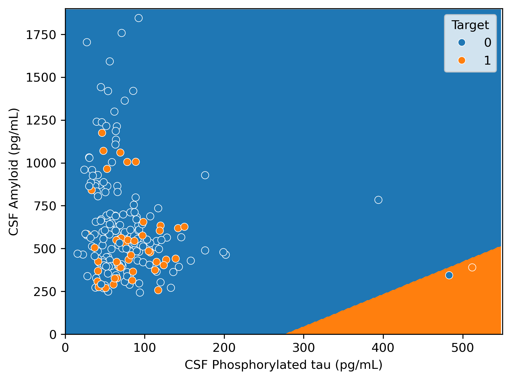
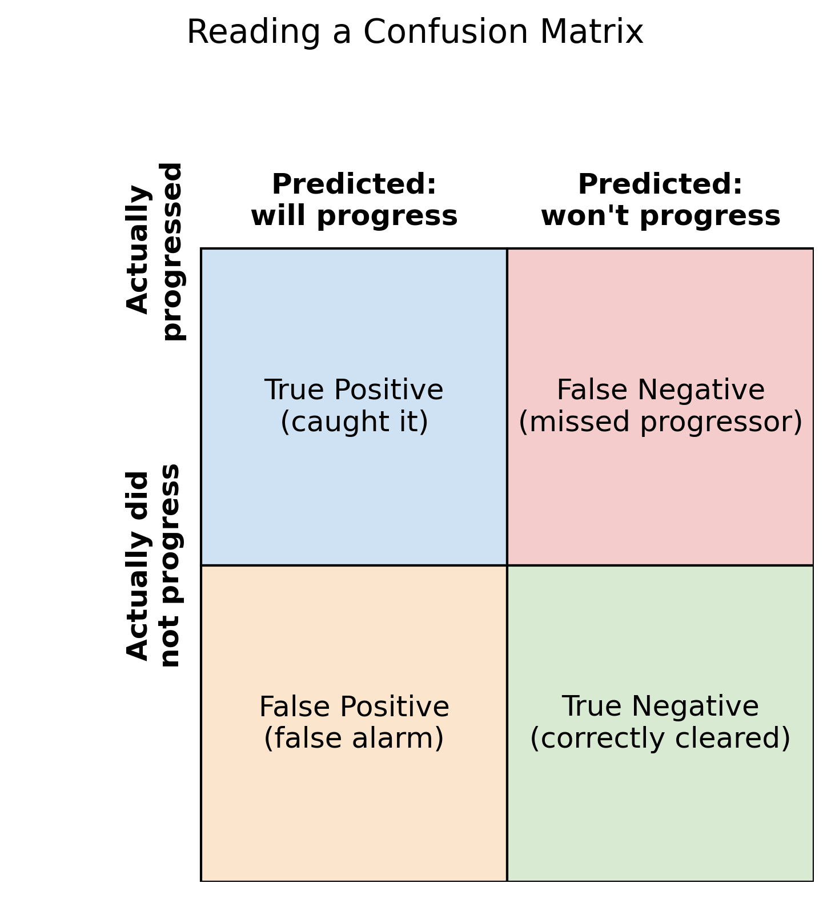
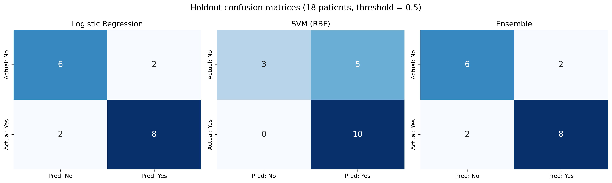
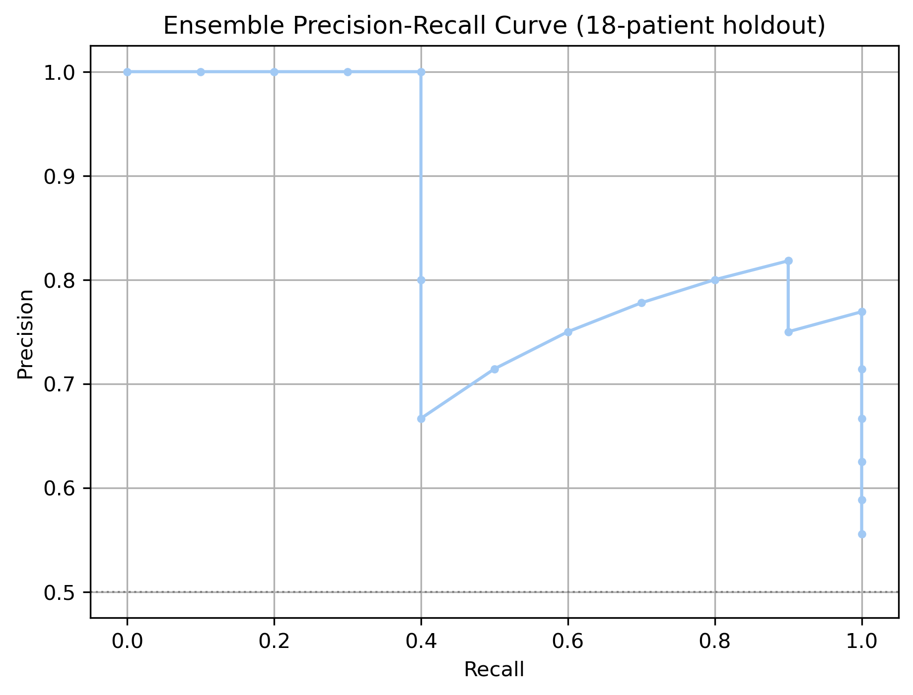
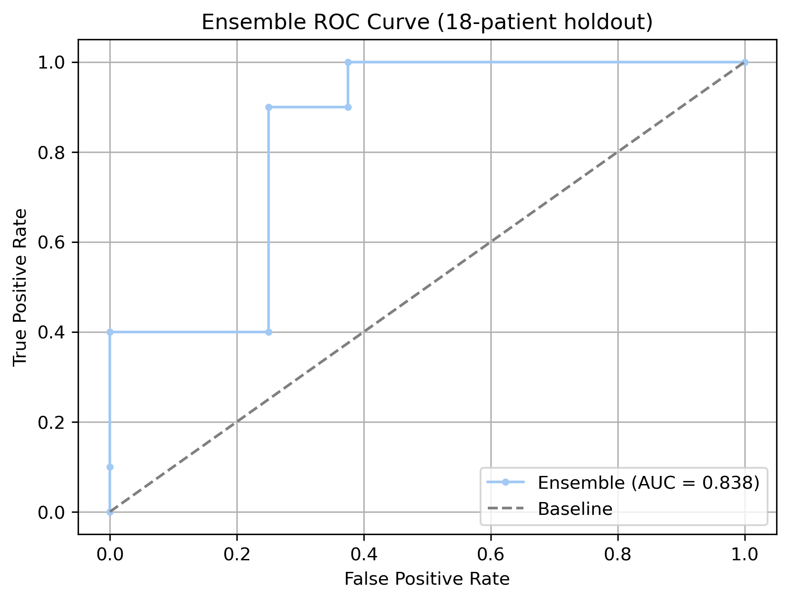

# UCB Capstone Project
U.C. Berkeley Engineering
## Predicting Progression to Alzheimer's Disease from Blood Protein Levels

### Abstract

Alzheimer's disease isn't a niche concern — it's an epidemic, and it gets worse every year as the population ages. [Mayo Clinic](https://newsnetwork.mayoclinic.org/discussion/mayo-clinic-scientists-create-tool-to-predict-alzheimers-risk-years-before-symptoms-begin/) researchers have shown that two proteins in spinal fluid — amyloid and tau — can point toward who is at risk of developing Alzheimer's, years before symptoms appear. This project asks a narrower, testable version of that question: **among patients already diagnosed with Mild Cognitive Impairment (MCI), can we predict who will progress to Alzheimer's, using blood/CSF protein levels alone?**

Real clinical data for a question like this is protected, for good reason. Instead, this project uses the Kaggle dataset [Plasma lipidomics in Alzheimer's disease](https://www.kaggle.com/datasets/fereshtehjozaghkar/plasma-lipidomics-in-alzheimers-disease) — real (not synthetic) patient measurements for 212 people, of whom 89 have a known MCI-to-Alzheimer's outcome. That's a genuinely small dataset for an epidemic-scale question, and that mismatch shapes nearly every decision in this project: every choice below leans toward caution rather than an impressive-looking headline number.

Two independent modeling approaches were built and are compared throughout this report:

- **[`logistic_regression_pipeline.ipynb`](logistic_regression_pipeline.ipynb)** — an exhaustive search over which biomarkers matter, landing on a simple, 2-feature Logistic Regression model.
- **[`svm_pipeline.ipynb`](svm_pipeline.ipynb)** — a broader comparison using all 7 available features, landing on a Support Vector Machine.

Both are deployed and combined into an ensemble in **[`main.ipynb`](main.ipynb)**, the project's main notebook. The full personal narrative behind the modeling decisions — including the reasoning and dead ends not shown here — is in [`NARRATIVE.md`](NARRATIVE.md).

This report follows the CRISP-DM methodology:

1. [Business Understanding](#business-understanding)
2. [Data Understanding](#data-understanding)
3. [Data Preparation](#data-preparation)
4. [Modeling](#modeling)
5. [Evaluation](#evaluation)
6. [Conclusion](#conclusion)
7. [References](#references)

---

# Business Understanding
### Clinical Background

Alzheimer's disease is marked by two key proteins in the brain: **amyloid**, which forms plaques, and **tau**, which forms tangles. Drugs recently approved by the FDA remove amyloid from the brain and can slow disease progression in people with MCI or mild dementia — which makes early, accurate identification of at-risk patients clinically valuable, not just academically interesting.

> "What's exciting now is that we're looking even earlier — before symptoms begin — to see if we can predict who might be at greatest risk of developing cognitive problems in the future."
> — Clifford Jack, Jr., M.D., radiologist and lead author, [Mayo Clinic study](https://newsnetwork.mayoclinic.org/discussion/mayo-clinic-scientists-create-tool-to-predict-alzheimers-risk-years-before-symptoms-begin/)

The Mayo Clinic's own prediction model combined age, sex, APOE genotype, and brain amyloid levels from PET scans. Of all the predictors they evaluated, amyloid levels had the single largest effect on lifetime risk of both MCI and dementia — which is why this project starts from the hypothesis that amyloid and tau levels, on their own, should carry real signal.

**The business question this project answers:** given a patient already diagnosed with Mild Cognitive Impairment, can their CSF protein levels tell us whether they are likely to progress to Alzheimer's — early enough that a clinician could act on it?

**Why false negatives matter more than false positives here:** a model that says "this patient won't progress" when they actually will is a patient who doesn't get monitored or treated early. That asymmetry — missing a progressor is worse than a false alarm — shapes every modeling decision in this report, not just the final headline metric.

# Data Understanding

The dataset contains 212 patients across three diagnostic categories:



Only the 89 patients already diagnosed with Mild Cognitive Impairment have a known "Progression to Alzheimer's Disease" outcome — nobody who is already healthy or already has an AD diagnosis has a progression label, because the question doesn't apply to them. So the real question this project answers is narrower than "who gets Alzheimer's": **of patients already showing MCI, who is going to get worse?** 47 of the 89 progress to Alzheimer's, 42 do not:



**Concerns**: 89 labeled patients is a small dataset. Small samples are sensitive to exactly which patients land in a given train/test split or cross-validation fold, so results throughout this report should be read as suggestive, not definitive.

**Class balance**: at 53% Yes / 47% No, the MCI subset is close enough to balanced that this study does not apply any class-balancing technique (e.g. oversampling, class weighting) to the training data.

### Setting expectations for the biology

Before any modeling, it's worth checking visually whether the two biomarkers the Mayo Clinic hypothesis points to — CSF amyloid and CSF phosphorylated tau — actually separate progressors from non-progressors in this dataset, and in the expected direction (low amyloid, high tau → higher risk):



Fitting Logistic Regression directly on these two biomarkers (scaled, using the same tuned hyperparameters the final model below lands on) draws a boundary that leans the way the biology predicts: patients with high tau need correspondingly high amyloid to land on the "no progression" side. The two classes overlap substantially rather than separating cleanly — expected, given how small and noisy this dataset is — but the overall lean of the boundary matches the clinical hypothesis, which is a reasonable sanity check before building anything more sophisticated. (See [`decision_boundaries.ipynb`](decision_boundaries.ipynb).)

As a second, more rigorous check, a single-feature Logistic Regression was fit on each candidate predictor individually, to see which ones carry statistically significant signal in this dataset before using any of them in a real model:

```
Feature(s)   AUC  p-value Significant (p<0.05)
                Age 0.550   0.3656                   No
                Sex 0.524   0.5195                   No
               MMSE 0.640   0.0360                  Yes
              APOE4 0.727   0.0010                  Yes
        CSF Amyloid 0.782   0.0010                  Yes
      CSF Total tau 0.728   0.0010                  Yes
Amyloid + Total tau 0.810   0.0010                  Yes
```

Age and Sex wash out — no real signal. Amyloid, Total tau, and APOE4 all clear the p < 0.05 bar, which is reassuring: it means this small, noisy dataset is able to reproduce a known clinical relationship before being asked to do anything harder.

# Data Preparation

Some MCI patients had missing values for individual biomarkers. Missing numeric values (Age, MMSE, CSF Amyloid, CSF Total tau, CSF Phosphorylated tau) were filled with that column's **median**; the one missing categorical value (APOE4 carrier status) was filled with that column's **mode** (most common value). Sex and APOE4 were converted from Yes/No text to 0/1. No rows were dropped and no class-balancing was applied — see "Class balance" above.

# Modeling

With the biology sanity-checked, the next question was purely methodological: given 7 candidate features, which should the model actually use, which classification algorithm should it be, and what hyperparameters should that algorithm have? These three decisions are tangled together — the best features depend on which algorithm you're picking them for, and the best hyperparameters depend on which features and algorithm you've already chosen. There's no obviously safe order to make them in.

Rather than guess an order, this project ran two **independent, exhaustive** pipelines, each committing to a different way of resolving that tangle, and compares their results honestly rather than picking a winner in advance.

## Approach 1: Exhaustive feature search → Logistic Regression

**[`logistic_regression_pipeline.ipynb`](logistic_regression_pipeline.ipynb)** resolves the ordering problem by brute force: it checks **every possible combination of features** before ever picking an algorithm.

1. **Feature search.** Every non-empty subset of the 7 candidate features was tried — 2⁷ − 1 = **127 combinations** — each scored with a neutral, fixed Logistic Regression so the feature search wouldn't be quietly biased toward whichever algorithm came next. Every combination was filtered to keep only those with a false-negative rate at or below 20% *before* ranking by accuracy — false negatives were never allowed to be traded away for a better headline number. Only 8 of 127 combinations survived that filter. The winner: **CSF Amyloid + CSF Phosphorylated tau**, a simpler pair than initially expected.
2. **Algorithm search.** That winning pair of features was then run through seven candidate algorithms (Logistic Regression, Random Forest, SVM, Gradient Boosting, KNN, LDA, Naive Bayes), with the same false-negative filter applied first. Logistic Regression won — a genuinely tuned win this time, not the neutral placeholder from step 1.
3. **Hyperparameter search.** `GridSearchCV` was run twice over Logistic Regression's `C` (regularization strength) and `class_weight`, once scored on plain recall and once on **F2** (a precision/recall blend that weights recall — catching progressors — twice as heavily as precision). Scoring on recall alone pushed the model toward flagging almost everyone as "will progress," which trimmed the false-negative rate a little further but gutted accuracy and precision along the way. Scoring on F2 struck a better balance and is the version actually deployed: **`C=10`, no class weighting.**

This is an honestly brute-force approach — the 127-combination search only works because there are just 7 candidate features (2ᴺ grows fast); a real biomarker panel with dozens of candidates would need a smarter search strategy instead.

## Approach 2: All 7 features → SVM

**[`svm_pipeline.ipynb`](svm_pipeline.ipynb)** takes a different route: instead of narrowing the feature list first, it uses all 7 raw features from the start and lets algorithm comparison do the work.

Seven classifiers (the same seven as above) plus a soft-voting ensemble of all seven were compared on the full feature set, first with default settings and then after `GridSearchCV` tuning (also scored on F2). Before tuning, Random Forest and SVM (RBF) came out essentially tied on recall (both caught 7 of 10 actual progressors), with Random Forest ahead on precision (0.875 vs. 0.778) and accuracy (0.778 vs. 0.722). Tuning on F2 broke that tie decisively: SVM's recall jumped to 0.90 (9 of 10 caught) while Random Forest barely moved — so **SVM (RBF)**, tuned to `C=0.1`, `gamma='scale'`, is this notebook's answer. Notably, the "wisdom of the crowd" voting ensemble of all seven models did *not* outperform the single best-tuned SVM.

## Why two different winners is not a contradiction

These two pipelines land on genuinely different answers — a 2-feature Logistic Regression vs. a 7-feature SVM — and neither is "wrong." With only 89 labeled patients, which algorithm looks best is sensitive to exactly how the data gets split, which features are kept, and which scoring function drives the search. Two reasonable, honest pipelines landing on two different winners is a real demonstration of that small-sample instability, not a bug in either one. See [`NARRATIVE.md`](NARRATIVE.md) for the full reasoning behind each decision.

Rather than pick a single "true" winner, `main.ipynb` deploys **both** models and averages their predicted probabilities as a simple two-model ensemble — treated here as one more honest data point, not a way to paper over the disagreement.

# Evaluation

### Reading a confusion matrix

Every prediction a model makes lands in one of four boxes, depending on what actually happened to the patient versus what the model guessed:



The box that matters most clinically is the **False Negative**: a patient who is actually heading toward Alzheimer's, but the model tells them — and their doctor — not to worry. Every metric below is really just a different way of watching that one box.

**Accuracy** — overall, how often was the model right?

$$\text{accuracy} = \frac{\text{true positives} + \text{true negatives}}{\text{everyone}}$$

Misleading on its own here, because it treats a missed progressor and a false alarm as equally bad — it can't tell them apart.

**Precision** — of everyone the model flagged as "will progress," how many actually did?

$$\text{precision} = \frac{\text{true positives}}{\text{true positives} + \text{false positives}}$$

**Recall** (sensitivity) — of everyone who actually progressed, how many did the model catch?

$$\text{recall} = \frac{\text{true positives}}{\text{true positives} + \text{false negatives}}$$

This one speaks directly to the False Negative box — it drops every time the model misses a real progressor.

**F2 score** — precision and recall combined into one number, weighted so recall (catching progressors) matters more:

$$F_2 = 5 \times \frac{\text{precision} \times \text{recall}}{4 \times \text{precision} + \text{recall}}$$

This is the score actually used to pick hyperparameters throughout this project, instead of accuracy — it bakes "don't miss progressors" directly into the number.

**AUC** (area under the ROC curve) — how well can the model tell a progressor from a non-progressor, before you even pick a decision cutoff?

$$\text{AUC} \in [0.5,\ 1.0]$$

0.5 is a coin flip; 1.0 is perfect separation. Unlike the other four, AUC doesn't depend on where the "will progress / won't progress" line gets drawn — it's a check on whether the underlying signal is real at all.

### Final results, side by side

Both models were evaluated on the same 18-patient holdout (10 actual progressors, 8 non-progressors) — data neither model was fit on:



| Model | Accuracy | Precision | AUC | False Negatives | False Negative Rate |
|---|---|---|---|---|---|
| Logistic Regression | 77.8% | 0.80 | 0.85 | 2 of 10 | 20% |
| SVM (RBF) | 72.2% | 0.67 | 0.73 | **0 of 10** | **0%** |
| Ensemble (average) | 77.8% | 0.80 | 0.84 | 2 of 10 | 20% |

A genuinely striking result: on this holdout, the SVM model catches **every single actual progressor** — zero false negatives — but pays for it with 5 false alarms out of 8 non-progressors, which is why its accuracy and precision look worse. Whether that trade is worth it depends entirely on how expensive a false alarm is versus a missed diagnosis — a judgment call for clinicians, not something a metric can settle on its own.

The simple 0.5-threshold ensemble average, in this case, doesn't clearly beat Logistic Regression alone — it lands on identical accuracy, precision, and false-negative count. Its ranking quality (AUC) is close to the average of the two, which is the honest, unglamorous result of averaging: the ensemble is only as good as its ability to blend two disagreeing models, and a fixed 0.5 cutoff doesn't automatically find the best trade-off.

### Precision, recall, and the cost of chasing zero false negatives

Rather than pick one decision threshold and stop, the ensemble's predicted probabilities were swept across every possible threshold to see the full trade-off curve:

 

Two things stand out. First, the ensemble's most confident predictions are trustworthy — its top few "will progress" calls are correct essentially every time. Second, precision falls as recall is pushed toward 1.0: catching every last progressor means accepting a meaningfully higher false-alarm rate. That's not a flaw in the model — it's the same real trade-off the SVM result above demonstrates directly, just shown as a continuous curve instead of one point.

### Sitting with the false negatives

The recurring discomfort throughout this project was false negatives: a patient the model tells "you're not progressing" who actually is. That's not an abstract number — it's a person who doesn't get monitored or treated early. That discomfort is the entire reason every search in this project filtered on false-negative rate *before* ever looking at accuracy, and why F2 — not accuracy, not plain AUC — is the scoring function that picked every final hyperparameter. A 77.8%-accuracy, 2-missed-progressor result is not perfect, but it's a deliberate, defensible trade-off rather than an accident of whichever metric happened to be optimized.

# Conclusion

89 labeled patients is not a lot, for a disease that affects millions. Every methodological choice in this project — stratified folds instead of a single split, exhaustive rather than greedy feature search, filtering on false-negative rate before optimizing anything else, comparing two independent pipelines instead of trusting the first answer — was a hedge against overfitting to a small, noisy sample. Both final models are saved and reproducible (`alzheimers_progression_model.joblib`, `svm_progression_model.joblib`), but neither should be read as deployment-ready without a larger, external validation cohort. The real finding of this project isn't a single number — it's that two honest, careful pipelines can disagree on the "best" model while agreeing on the underlying biology, and that disagreement is itself useful information for anyone deciding how much to trust either one.

The full personal reasoning behind these decisions — including the parts that didn't work and the discomfort with false negatives that shaped nearly every choice — is written up in [`NARRATIVE.md`](NARRATIVE.md).

# References

- Mayo Clinic: [Mayo Clinic scientists create tool to predict Alzheimer's risk years before symptoms begin](https://newsnetwork.mayoclinic.org/discussion/mayo-clinic-scientists-create-tool-to-predict-alzheimers-risk-years-before-symptoms-begin/)
- Dataset: [Plasma lipidomics in Alzheimer's disease](https://www.kaggle.com/datasets/fereshtehjozaghkar/plasma-lipidomics-in-alzheimers-disease) (Kaggle)
- Notebooks: [`main.ipynb`](main.ipynb) · [`logistic_regression_pipeline.ipynb`](logistic_regression_pipeline.ipynb) · [`svm_pipeline.ipynb`](svm_pipeline.ipynb) · [`decision_boundaries.ipynb`](decision_boundaries.ipynb)
- Full project narrative: [`NARRATIVE.md`](NARRATIVE.md)
